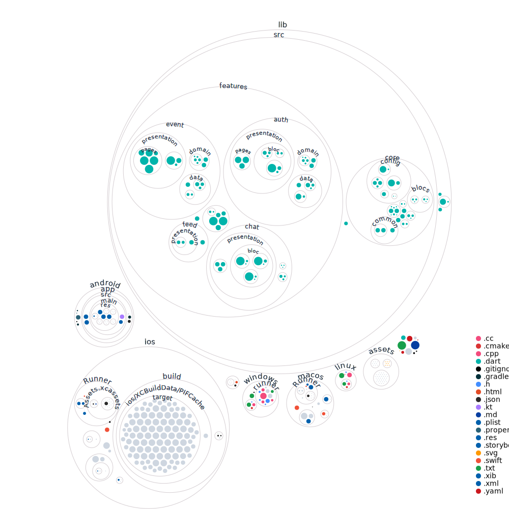

## Anggota Kelompok

- Adrian Pratama Sasmita (231524033)
- Alya Naila Putri Ashadilla (231524036)
- Faisal Bashri Albir (231524042)
- Muhammad Hasbi Asshidiqi (231524054)
- Muhammad Samudera Bagja (231524058)
- Muhammad Zaky Aliyashfi (231524059)
- Yahya Alfon Sinaga (231524064)

---

### **Deskripsi Umum Aplikasi**

Aplikasi ini dirancang untuk membantu mahasiswa dalam suatu himpunan mahasiswa agar dapat dengan mudah mengakses informasi tentang program kerja (proker) yang diadakan oleh berbagai departemen di himpunan tersebut. Proker biasanya disosialisasikan melalui berbagai media komunikasi, namun cara ini dirasa kurang efektif dan terstruktur. Oleh karena itu, aplikasi ini akan menjadi platform sentral yang memungkinkan mahasiswa untuk melihat, mendukung, dan berinteraksi dengan program-program kerja yang sedang atau akan dilaksanakan.

---

## Visualization of this repo

---

### **Fitur Utama Aplikasi**

1. **Daftar Program Kerja (Proker)**  
   Mahasiswa dapat melihat daftar proker yang sedang berjalan atau akan dilaksanakan. Proker dibagi ke dalam tiga state:
   - **Belum Diterima**: Proker masih dalam proses pengajuan.
   - **Sudah Diterima (Upcoming)**: Proker sudah diterima dan dalam tahap persiapan.
   - **Sudah Dilaksanakan**: Proker telah selesai dilaksanakan.

2. **Upvote Program Kerja**  
   Mahasiswa dapat memberikan "upvote" pada proker yang berada dalam state "Belum Diterima" sebagai bentuk dukungan. Jumlah upvote dapat menjadi indikasi minat mahasiswa terhadap proker tersebut dan dapat memengaruhi pengambilan keputusan pembina himpunan.

3. **Forum Diskusi & Chat**  
   Setiap proker memiliki fitur forum yang memungkinkan mahasiswa untuk berdiskusi, bertanya, atau memberikan saran terkait proker. Terdapat juga fitur chat privat antara mahasiswa dan pengelola proker jika ada pertanyaan lebih lanjut atau hal-hal yang bersifat personal.

4. **Informasi Lengkap Program Kerja**  
   Mahasiswa dapat melihat detail lengkap proker, mulai dari deskripsi, tujuan, manfaat, dan informasi tambahan seperti tanggal, tempat, biaya pendaftaran, dan rundown acara.

5. **Dokumentasi Proker**  
   Setelah proker selesai dilaksanakan, dokumentasi acara (misalnya foto dan video) dapat diunggah dan diakses oleh mahasiswa.

---

### **Role Pengguna**

1. **Mahasiswa**  
   - Mahasiswa dapat mengakses informasi terkait proker yang tersedia.
   - Mereka bisa memberikan upvote pada proker yang belum diterima.
   - Mahasiswa juga bisa menggunakan forum untuk berdiskusi dan fitur chat untuk bertanya langsung kepada pengelola proker.

2. **Pengelola (Departemen)**  
   - Pengelola memiliki peran untuk menambahkan proker baru, memperbarui status proker, dan mengunggah informasi terkait proker.
   - Mereka bertanggung jawab untuk mengelola forum diskusi dan menjawab pertanyaan dari mahasiswa melalui fitur chat.
   - Pengelola juga bisa menambahkan dokumentasi acara setelah proker selesai.

---

### **State Program Kerja**

Proker dalam aplikasi ini dikategorikan ke dalam tiga state, yang membantu mahasiswa dan pengelola untuk memantau perkembangan setiap proker:

1. **Belum Diterima/Diacc**  
   - Pada tahap ini, proker masih dalam proses pengajuan dan belum di-acc oleh pembina himpunan.
   - Informasi seperti deskripsi proker, urgensi, output, dan dokumentasi sebelumnya dapat ditambahkan oleh pengelola.
   - Mahasiswa bisa memberikan upvote untuk mendukung proker tersebut.

2. **Sudah Diterima (Upcoming)**  
   - Proker telah diterima oleh pembina himpunan dan dalam tahap persiapan untuk dilaksanakan.
   - Pengelola dapat memperbarui informasi terkait waktu, tempat, rundown, biaya, dan dresscode.
   - Mahasiswa dapat menggunakan forum dan chat untuk berinteraksi terkait proker ini.

3. **Sudah Dilaksanakan**  
   - Proker telah selesai dilaksanakan.
   - Dokumentasi acara seperti foto atau video dapat diunggah, dan mahasiswa dapat mengakses dokumentasi tersebut.

---

### **Manfaat dan Tujuan Aplikasi**

- **Efisiensi dan Transparansi**: Aplikasi ini memudahkan mahasiswa dalam mendapatkan informasi yang terstruktur mengenai proker di himpunan, tanpa harus menunggu sosialisasi langsung.
- **Partisipasi Aktif Mahasiswa**: Fitur upvote dan forum diskusi mendorong mahasiswa untuk terlibat secara aktif dalam proker.
- **Kolaborasi Pengelola**: Pengelola dari setiap departemen bisa lebih mudah mengelola proker, termasuk memperbarui informasi dan berinteraksi langsung dengan mahasiswa.

---

## Tech Stack

1. **Flutter (Dart)**: Framework untuk membangun aplikasi mobile dengan UI responsif, mendukung Android dan iOS, berbasis pada bahasa pemrograman Dart.
2. **Firebase**: Platform backend untuk autentikasi pengguna, penyimpanan data real-time, dan fitur chat. Firebase juga mendukung notifikasi push.
3. **ExpressJS (Node.js)**: Framework untuk membuat RESTful API yang digunakan sebagai backend aplikasi, mengelola komunikasi antara aplikasi dan database.
4. **Firebase Firestore**: Database NoSQL yang digunakan untuk menyimpan data program kerja secara real-time.
5. **Cloud Storage**: Untuk menyimpan file seperti dokumentasi program kerja dalam bentuk foto atau video.
6. **Google Cloud Functions**: Menggunakan serverless functions untuk menjalankan operasi backend secara dinamis saat diperlukan.

---

## Aplikasi dalam Konteks Paradigma dan Prinsip Pemrograman

### **Paradigma Pemrograman**

1. **Object-Oriented Programming (OOP)**:
   - **Di Flutter**: Aplikasi ini menggunakan OOP karena Flutter berbasis Dart yang mendukung kelas dan objek. Setiap halaman atau fitur seperti program kerja dan chat dibuat sebagai objek dengan properti dan fungsi sendiri.
   - **Manfaat**: Memungkinkan reuse kode dan mempermudah pengembangan dengan pembagian yang jelas antar komponen.

### **Prinsip Pemrograman**

1. **Concurrency (Konkuren)**:
   - **Isolates di Dart**: Tugas yang berat, seperti pemrosesan data, dijalankan secara bersamaan tanpa mengganggu aplikasi. Contohnya, mengambil data dari server dan memperbarui UI secara bersamaan.

2. **Event-Driven Programming**:
   - **Event Loop di Flutter**: Aplikasi merespons perubahan state, misalnya, ketika program kerja diperbarui, UI juga akan diperbarui.
   - **Fitur Chat**: Pada aplikasi ini, fitur chat menggunakan Firebase untuk komunikasi real-time. Firebase memungkinkan pesan dikirim dan diterima secara langsung, dengan UI yang diperbarui setiap kali ada perubahan data. **Sebelumnya**, tim telah mengembangkan aplikasi chat berbasis WebSocket, yang memungkinkan komunikasi dua arah secara real-time. Kini, chat pada aplikasi ini menggunakan Firebase sebagai pengganti WebSocket, yang menyediakan layanan real-time secara lebih sederhana dan terintegrasi.

3. **RESTful API & CRUD Operations**:
   - **Backend ExpressJS**: Operasi seperti membuat, membaca, memperbarui, dan menghapus program kerja dilakukan melalui RESTful API, dengan metode HTTP seperti GET, POST, PUT, dan DELETE.

4. **State Management**:
   - **Provider/BLoC**: Untuk mengelola state aplikasi, seperti data program kerja atau status login, digunakan pendekatan state management agar perubahan langsung terlihat di UI.
   - **Reactive Programming**: Aplikasi merespons setiap perubahan data secara otomatis.

5. **Asynchronous Programming**:
   - **Dart Future & Async/Await**: Operasi seperti mengambil data dari Firebase dilakukan secara asinkron, sehingga aplikasi tidak "hang" saat menunggu data diambil.
   - **Contoh**: Pengambilan daftar program kerja dari server dilakukan tanpa mengganggu penggunaan aplikasi.

## Why Mobile?

1. **Akses Mudah dan Portabel**:
   - Mahasiswa sering menggunakan ponsel, memudahkan akses kapan saja. Notifikasi push real-time juga lebih efektif dibandingkan web.

2. **Interaksi Cepat**:
   - Aplikasi langsung dibuka tanpa perlu browser, dan dapat menyimpan data offline untuk dilihat tanpa koneksi internet.

3. **Notifikasi Push**:
   - Pemberitahuan program kerja, status, atau diskusi penting langsung ke ponsel, lebih efektif dibandingkan di web.

4. **Fitur Native Ponsel**:
   - Memanfaatkan fitur seperti kalender, kamera, dan GPS yang sulit diimplementasikan dengan web.

5. **User Experience Lebih Baik**:
   - UI/UX dirancang khusus untuk layar kecil, membuat navigasi lebih cepat dan nyaman dibandingkan dengan web responsif.

6. **Interaksi Real-time dan Keaktifan Pengguna**:
   - Pengguna lebih sering mengecek ponsel, sehingga fitur seperti chat dan diskusi lebih aktif dibandingkan di web.

## Flutter Vs Kotlin

Berikut adalah tabel perbandingan Flutter (Dart) dan Kotlin dengan fokus pada aspek penggunaannya dalam pembuatan aplikasi mobile.

| **Aspek**                   | **Flutter (Dart)**                                       | **Kotlin**                                         | **Komentar**                                                                                   |
|------------------------------|---------------------------------------------------------|---------------------------------------------------|-----------------------------------------------------------------------------------------------|
| **Platform Dukungan**        | *Cross-platform* (iOS & Android)                        | *Native Android*                                  | **Flutter lebih baik**: Mendukung kedua platform sekaligus, hemat waktu untuk pengembangan.    |
| **Pengembangan UI**          | Menggunakan *widget* siap pakai dan konsisten           | Berbasis XML, lebih fleksibel                     | **Flutter lebih baik**: Pengembangan UI lebih cepat dengan *hot reload*.                       |
| **Akses Fitur Native**       | Menggunakan *plugin* atau *channel*                     | Akses langsung melalui API Android                | **Kotlin lebih baik**: Lebih fleksibel dalam menggunakan fitur *native*.                       |
| **Waktu Pengembangan**       | Lebih cepat untuk aplikasi lintas platform              | Lebih lama karena hanya Android                  | **Flutter lebih baik**: Cocok untuk tim kecil dengan kebutuhan multi-platform.                 |
| **Hot Reload**               | Mendukung perubahan instan pada UI dan logika           | Mendukung sebagian, tapi tidak secepat Flutter    | **Flutter lebih baik**: Pengujian UI lebih cepat dan efisien.                                  |
| **Integrasi Firebase**       | Pustaka siap pakai untuk semua fitur Firebase           | Butuh lebih banyak kode manual untuk beberapa fitur | **Flutter lebih baik**: Mendukung penuh Firebase dengan *plugin* sederhana.                   |
| **Dokumentasi**              | Dokumentasi lengkap, cocok untuk pemula                | Dokumentasi kuat tapi lebih kompleks             | **Flutter lebih baik**: Dokumentasi dan panduan lebih mudah diikuti untuk pengembang baru.     |
| **Komunitas Pengembang**     | Komunitas besar dengan fokus pada *cross-platform*      | Komunitas besar, terutama Android developer      | **Kedua sama baiknya**: Komunitas besar untuk mendapatkan solusi masalah.                      |
| **Kinerja Aplikasi**         | Hampir mendekati *native*, tapi UI lebih berat          | Optimal, hampir sama dengan aplikasi *native*     | **Kotlin lebih baik**: Aplikasi lebih ringan, terutama untuk fitur berat.                      |
| **Ekosistem Pustaka**        | Pustaka *cross-platform* yang berkembang pesat          | Pustaka *native* Android sangat lengkap           | **Kotlin lebih baik**: Pustaka Android lebih matang dan mendalam.                              |
| **Kemudahan Animasi**        | Dukungan bawaan dengan pustaka seperti `Hero` dan `Lottie`| Harus diatur manual menggunakan pustaka pihak ketiga | **Flutter lebih baik**: Animasi lebih mudah dibuat.                                            |
| **Modularitas Kode**         | Struktur proyek lebih terorganisir dengan *widget tree* | Bergantung pada struktur manual pengembang       | **Flutter lebih baik**: Kode lebih modular dan terstruktur.                                    |
| **Kesulitan Belajar**        | Lebih mudah dipelajari, terutama untuk pemula           | Butuh pemahaman mendalam tentang Android          | **Flutter lebih baik**: Pemula dapat lebih cepat memahami konsep dasarnya.                     |
| **Pemeliharaan**             | Satu basis kode untuk dua platform                      | Fokus hanya untuk Android                         | **Flutter lebih baik**: Pemeliharaan lebih hemat waktu karena basis kode tunggal.              |

### Kesimpulan  

- Jika aplikasi yang dibuat membutuhkan pengembangan *cross-platform* dengan UI menarik dan waktu pengembangan yang lebih cepat, Flutter adalah pilihan yang lebih baik.  
- Namun, jika aplikasi fokus pada Android dengan kebutuhan akses mendalam ke fitur *native*, Kotlin lebih optimal.

## 11 Miskonsepsi dalam Development Mobile Apps (Flutter, Kotlin, Xamarin, Native React)

### **Miskonsepsi 1: Penggunaan framework lintas platform akan selalu mengurangi biaya pengembangan.**  
**Penjelasan:**  
Banyak yang percaya bahwa menggunakan framework lintas platform seperti Flutter, React Native, atau Xamarin akan selalu lebih hemat biaya dibandingkan pengembangan native. Namun, kenyataannya bergantung pada kompleksitas proyek dan kebutuhan spesifik aplikasi.

**Fakta:**  
- **Kompleksitas Fitur:** Jika aplikasi memerlukan integrasi yang mendalam dengan platform (seperti akses ke API sistem atau hardware tertentu), framework lintas platform dapat memerlukan penulisan kode tambahan dalam native, sehingga mengurangi penghematan biaya.  
- **Tim Pengembang:** Biaya juga dipengaruhi oleh tingkat keahlian tim. Jika tim lebih berpengalaman dalam native development, transisi ke framework lintas platform dapat memerlukan pelatihan tambahan. 
- **Maintenance Jangka Panjang:** Framework lintas platform seperti React Native atau Xamarin sering memerlukan pembaruan lebih sering untuk kompatibilitas dengan platform baru, yang dapat meningkatkan biaya pemeliharaan.  

---

### **Miskonsepsi 2: Native development (Kotlin/Swift) selalu memberikan performa terbaik.**

**Penjelasan:** Ada asumsi bahwa hanya native development yang bisa memberikan performa terbaik, sedangkan framework lintas platform dianggap lebih lambat.

**Fakta:**

- Flutter menggunakan rendering langsung tanpa memerlukan "bridge," sehingga performanya mendekati native.
- Untuk UI kompleks, pengembangan Flutter sering lebih cepat dan tetap responsif.
- Kotlin/Swift tetap unggul untuk aplikasi yang memerlukan integrasi mendalam dengan platform atau akses penuh ke API native.

---

### **Miskonsepsi 3: Flutter hanya cocok untuk aplikasi sederhana.**

**Penjelasan:** Ada anggapan bahwa Flutter hanya efektif untuk prototipe atau aplikasi kecil, bukan untuk aplikasi dengan fitur atau skala besar.

**Fakta:**

- Flutter digunakan oleh perusahaan besar seperti Google (Google Pay) dan Alibaba untuk aplikasi produksi.
- Dengan dukungan library dan plugin yang luas, Flutter dapat menangani aplikasi kompleks.
- Kemampuan hot reload mempercepat iterasi selama pengembangan, bahkan untuk aplikasi berskala besar.

---

### **Miskonsepsi 4: React Native lebih fleksibel karena menggunakan JavaScript.**

**Penjelasan:** Karena JavaScript adalah bahasa universal, banyak yang mengira bahwa React Native otomatis lebih fleksibel dibandingkan framework lain.

**Fakta:**

- React Native membutuhkan "bridge" untuk berkomunikasi dengan elemen native, yang dapat menyebabkan penurunan performa.
- Flutter menggunakan satu set widget bawaan yang konsisten, sehingga seringkali lebih stabil untuk pengembangan UI.
- Meskipun JavaScript lebih dikenal, Dart (bahasa Flutter) memiliki learning curve yang ringan bagi developer baru.

---

### **Miskonsepsi 5: Xamarin adalah pilihan terbaik karena mendukung C#, yang cocok untuk enterprise.**

**Penjelasan:** Xamarin sering dipilih oleh pengembang enterprise karena menggunakan C#, bahasa yang umum di dunia bisnis.

**Fakta:**

- Xamarin memiliki keunggulan dalam integrasi dengan ekosistem Microsoft, tetapi sering lebih berat dibandingkan Flutter.
- Lisensi Xamarin sebelumnya mengandalkan model Microsoft, membuatnya kurang fleksibel bagi pengembang kecil.
- Flutter dan React Native memiliki komunitas yang lebih besar, memberikan lebih banyak dukungan teknis.

---

### **Miskonsepsi 6: Framework baru lebih baik daripada teknologi lama seperti Kotlin/Swift.**

**Penjelasan:** Ada anggapan bahwa framework baru otomatis menggantikan teknologi lama yang dianggap ketinggalan zaman.

**Fakta:**

- Kotlin/Swift adalah standar industri untuk pengembangan native dan menawarkan dukungan penuh terhadap fitur terbaru platform.
- Framework seperti Flutter lebih efisien untuk aplikasi lintas platform tetapi tidak menggantikan kebutuhan native dalam kasus spesifik.
- Teknologi lama sering lebih stabil dan teruji untuk proyek skala besar.

---

### **Miskonsepsi 7: Semua framework lintas platform memiliki performa buruk dibanding native.**

**Penjelasan:** Framework lintas platform seperti Flutter, React Native, atau Xamarin sering dianggap lebih lambat daripada native development.

**Fakta:**

- Flutter menunjukkan performa mendekati native karena menggunakan engine rendering langsung.
- React Native lebih fleksibel tetapi bergantung pada "bridge," yang dapat mempengaruhi performa.
- Xamarin sering menghadapi overhead performa, tetapi cocok untuk pengembang yang sudah familier dengan ekosistem Microsoft.

---

### **Miskonsepsi 8: Kotlin adalah satu-satunya pilihan untuk pengembangan aplikasi Android yang modern.**

**Penjelasan:** Banyak yang menganggap bahwa Kotlin adalah satu-satunya opsi terbaik untuk pengembangan aplikasi Android.

**Fakta:**

- Flutter memungkinkan pengembangan Android dengan UI performa tinggi yang dapat diakses di platform lain secara bersamaan.
- Kotlin unggul untuk aplikasi yang memerlukan integrasi mendalam dengan fitur eksklusif Android.
- Framework lintas platform seperti Flutter mengurangi waktu dan biaya pengembangan dengan satu basis kode untuk beberapa platform.

---

### **Miskonsepsi 9: Flutter hanya untuk prototyping, bukan aplikasi produksi.**

**Penjelasan:** Karena Flutter relatif baru, banyak yang mengira bahwa Flutter hanya cocok untuk pengembangan awal aplikasi.

**Fakta:**

- Flutter digunakan dalam produksi oleh perusahaan besar seperti Google, Alibaba, dan ByteDance.
- Dukungan komunitas yang kuat serta pembaruan rutin membuat Flutter stabil untuk aplikasi skala besar.
- Flutter juga memiliki ekosistem package yang kaya untuk memenuhi berbagai kebutuhan aplikasi.

---

### **Miskonsepsi 10: Xamarin lebih aman untuk pengembangan aplikasi enterprise.**

**Penjelasan:** Karena Xamarin mendukung C#, banyak yang mengira bahwa itu adalah pilihan paling aman untuk aplikasi bisnis.

**Fakta:**

- Xamarin memang mendukung fitur keamanan enterprise, tetapi Flutter dan React Native memiliki library keamanan yang terus berkembang.
- Flutter sering lebih ringan dan memiliki dukungan komunitas yang luas untuk debugging dan pemecahan masalah.
- Xamarin memiliki keterbatasan dalam mengikuti pembaruan fitur platform dibandingkan framework lain.

---

### **Miskonsepsi 11: Hanya framework native yang mampu memanfaatkan fitur hardware terbaru.**

**Penjelasan:** Ada asumsi bahwa framework lintas platform tidak dapat mengakses fitur hardware terbaru seperti native development.

**Fakta:**

- Flutter dan React Native mendukung fitur hardware melalui plugin yang tersedia di komunitas.
- Native development tetap lebih unggul untuk fitur hardware yang sangat spesifik atau baru, tetapi framework lintas platform semakin kompetitif.
- Dukungan yang baik dari komunitas memungkinkan pengembang untuk menambahkan fitur yang belum tersedia secara default.

## Reliability dalam bahasa pemrograman
- prinsip tipe data dan keamanan data
- immutability
- abstraksi